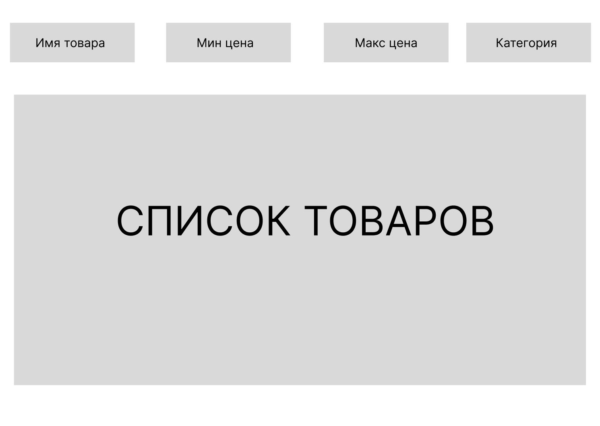

# Пагинация
Ваша задача подготовить бэкенд для сайта с продуктовыми товарами.
Сайт - одностраничник, на котором отображается список товаров.
Вверху сайта есть поиск по имени товаров (любой регистр и алфавит), фильтр по промежутку цены и заданным категориям товаров
Схематическая структура сайта

На одной странице отображается N товаров. При скролле вниз до конца прогружается еще N товаров

На бэкенд мы отправляем лимит(опционально) вместе с курсором или фильтром. Если мы отправим вместе, то не понятно, на какие данные нам ориентироваться. Потому что фильтр отправялется, когда мы хотим читать данные с самого начала. А курсор для указания, откуда нам нужно брать эти данные

Если мы получили кол-во данных меньше лимита, то курсор не надо возвращать. Чтобы фронтенд не запрашивал еще раз данные.

Выходные данные должны быть отсортированые по имени.

## Подробнее про курсор
Курсор указывает на место, в котором мы находимся в бд.
Сначала фронтенд посылает запрос с фильтром и лимитом. Бэкенд по своим правилам формирует курсор, который позволяет понять, откуда двигаться в следующий раз.
Бэкенд отдает запрошенные данные и, если есть еще данные после, то отдает курсор

## Пример того, как можно сделать курсор
Фильтр сериализуется в json, json в виде строки кодируеются в base64. Так же происходит и в обратном порядке, когда фронтенд присылает курсор. base64 декодируется в строку, из строки получают json. После чего

## Definition of done
 - написан бэкенд
 - ручка покрыта тестами